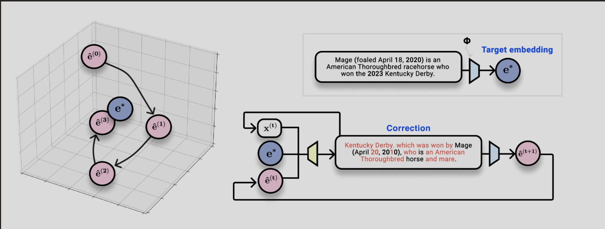

# Cracking the Code: Hacking Vector Embeddings



*Image Source: [Understanding and Mitigating the Threat of Vec2Text to Dense Retrieval Systems](https://arxiv.org/html/2402.12784v2)*

---

## Understanding Text Recoverability

Text recoverability refers to the ability to reconstruct the original text from its embedded form. This process is made possible through a method known as **embedding inversion**. Techniques like Vec2Text exemplify this by iteratively generating hypotheses to approximate the target text based on its embedding.

**Why is this significant?**

Embeddings are designed to capture the semantic essence of text. If someone can invert an embedding to retrieve the original text or a close approximation, it poses a significant privacy risk, especially when dealing with sensitive information.

---

## Privacy Risks in Dense Retrieval Systems


Dense retrieval systems utilize embeddings to enhance search accuracy by capturing semantic similarities between queries and documents. However, their reliance on embeddings introduces potential vulnerabilities:

- **Embedding Inversion**: Attackers can reconstruct sensitive text data from embeddings.
- **Data Leakage**: Exposed embeddings can reveal proprietary or confidential information.
- **Privacy Breach**: Personal or sensitive user data can be compromised.

These risks underscore the necessity for robust privacy-preserving measures in systems handling sensitive data.

---

## Mitigating Privacy Risks with Embedding Transformation

To address these privacy concerns, researchers have proposed **embedding transformation techniques**. By applying unique transformations to embeddings, it's possible to maintain retrieval effectiveness while reducing the risk of text reconstruction.

**How does it work?**

- **Transformation Functions**: Apply mathematical operations to embeddings that preserve relative distances but obfuscate the exact values.
- **Noise Addition**: Introduce controlled noise to embeddings to prevent exact inversion while maintaining utility.
- **Dimensionality Reduction**: Reduce the embedding size to limit the information available for inversion.

These methods alter the embedding space in a way that preserves semantic relationships but makes it significantly harder to reconstruct the original text.

While embedding transformation techniques offer promising solutions to mitigate privacy risks, they also come with their own set of challenges:

1. **Loss of Information**: Transformation functions and dimensionality reduction can lead to a loss of information. While they obfuscate the original text, they may also inadvertently remove important semantic details, potentially affecting the performance of the model.

2. **Increased Complexity**: The process of transforming embeddings adds an extra layer of complexity to the model. This can make the model more difficult to understand and interpret, and could potentially increase the computational resources required.

3. **Noise Addition Trade-offs**: While adding noise can prevent exact inversion, it's a delicate balance. Too much noise can degrade the utility of the embeddings, while too little may not sufficiently protect against inversion. Finding the right balance can be challenging.

4. **Effectiveness Against Advanced Attacks**: While these methods can make it harder to reconstruct the original text, they may not be completely effective against more advanced attacks. Sophisticated attackers may still be able to reverse-engineer the transformations or use other techniques to recover the original text.

5. **Implementation Challenges**: Implementing these transformations in a consistent and effective manner across different models and datasets can be challenging. It requires careful planning and testing to ensure that the transformations do not adversely affect the model's performance.

---

## The Challenge of Sophisticated Attacks


If an attacker can discern the pattern of transformation applied to the embeddings, they could potentially reverse-engineer the process, reconstructing the original embeddings and, subsequently, the original text.

This is particularly concerning if the transformation process is deterministic and consistently applies the same transformation to the embeddings. Once the attacker understands the transformation function, they could apply the inverse of this function to the transformed embeddings to recover the original embeddings.

Moreover, if the attacker has access to a large amount of transformed data and corresponding original text, they could potentially use machine learning techniques to learn the transformation function. This could then be used to brute-force the transformation on other transformed embeddings, effectively bypassing the privacy measures.

This highlights the importance of not only applying transformations but also ensuring that these transformations are complex and varied enough to resist such sophisticated attacks. Techniques such as randomizing the transformation function or adding a sufficient amount of noise could help in making the reverse-engineering process more difficult. However, these methods also need to be balanced with the need to preserve the utility of the embeddings for their intended purpose.

---

## Reverse Engineering Embeddings: A Code Walkthrough


### Bruteforcing is Resource-Intensive

The process of embedding inversion, particularly through bruteforcing, can be computationally expensive and time-consuming. It involves generating a large number of hypotheses and calculating the error between the target embedding and the embedding of each hypothesis. This iterative process continues until a satisfactory approximation of the target text is achieved or a predefined cost limit is reached.

The resource-intensive nature of bruteforcing can pose challenges, especially when dealing with large datasets or complex models. It requires significant computational power and can lead to increased costs and longer processing times. Therefore, it's crucial to find ways to optimize this process and make it more efficient.

**Ray: A Catalyst for Parallel Processing**

To accelerate the embedding inversion process, we leverage the power of Ray, a versatile framework for parallel and distributed computing. Ray enables us to efficiently distribute tasks across multiple machines or cores, significantly speeding up the generation and evaluation of guesses. 

By parallelizing the process, we can simultaneously run multiple instances of the guess generation and evaluation function. This allows us to explore a wider range of possibilities and converge on the correct solution more quickly. 

Ray's simplicity and scalability make it an ideal tool for tackling computationally intensive tasks like embedding inversion, where time and computational resources are critical factors. 

To tackle this challenge, we'll use the following tools:

- **Large Language Models (LLMs):** To generate intelligent guesses based on prior attempts and clues.
- **Embeddings:** To represent both the target and guessed texts in numerical form for comparison.
- **Ray:** A framework for parallel and distributed computing, enabling us to run multiple guess evaluations concurrently.
- **NumPy:** For numerical computations and calculating vector errors.
- **Logging:** To keep track of the process and results.

---

Let's dive into the code step by step.

### 1. Importing Libraries and Initializing Ray

```python
import time
import logging
import numpy as np
import ollama
from langchain_ollama import OllamaEmbeddings
import ray

def demo():
    # Initialize Ray
    ray.init()
```

We start by importing the necessary libraries and initializing Ray for parallel computation.

### 2. Setting Up Logging and Parameters

```python
start_time = time.time()  # Start time tracking

desiredModel = 'llama3.2:3b'

logging.Formatter.default_msec_format = '%s.%03d'
logging.basicConfig(
    level=logging.INFO,
    format="%(asctime)s [%(levelname)s] %(message)s",
    handlers=[
        logging.FileHandler("reverse_vector.log", 'w'),
        logging.StreamHandler()
    ]
)
```

We set up logging to monitor the process and define parameters such as the desired LLM model.

### 3. Defining the Target Text and Computing Its Embedding

```python
# Encode the TARGET "mystery" vector to be reversed
# (otherwise, fetch it from somewhere - like a vector database)
TARGET = "Be mindful"

embeddings = OllamaEmbeddings(
    model="nomic-embed-text",
)
res = embeddings.embed_documents([TARGET])
v_target = np.array(res)
```

We define the mystery text `"Be mindful"` and compute its embedding using a pre-trained model.

### 4. Setting Stop Conditions

```python
# Stop conditions
MATCH_ERROR = 0.6  # 55% confidence or better
COST_LIMIT = 60.0  # $60 budget spent
```

We define conditions to terminate the search: a match error threshold and a cost limit.

### 5. Managing Shared State with a Ray Actor

```python
@ray.remote
class SharedState:
    def __init__(self):
        self.CURRENT_BEST_TEXT = "Be"
        self.CURRENT_BEST_ERROR = np.inf
        self.GUESSES_MADE = 0
        self.TOTAL_COST = 0.0
        self.MATCH_FOUND = False
        self.PREVIOUS_GUESSES = set()
    # Methods to update and retrieve state...
```

We use a Ray actor to manage shared state across parallel processes, keeping track of the best guess, number of guesses made, and previous guesses.

### 6. Crafting the Prompt for the LLM

```python
prompt_template = f"""User input is last iterative guess of an unknown text string and its vector ERROR from the unknown text.
Determine better text strings having lower vector ERRORs and write one such string in English as your entire output.
The goal is to accurately guess the mystery text.
This is a game of guess-and-check.

[clue]
TWO WORDS; CLUE: FIRST WORD IS `Be`; SECOND WORD YOU HAVE TO GUESS.
[/clue]

[IMPORTANT]
- Do NOT repeat any of the previous guesses provided in [context].
- Do NOT include your thought process in your response.
- Your response should be coherent and exactly two words.
[/IMPORTANT]
"""
```

We create a prompt to guide the LLM in generating new guesses. The prompt includes:

- The last guess and its vector error.
- Clues about the mystery text.
- Instructions to avoid repeating previous guesses and to output only the guess.

### 7. Defining the Function to Generate and Evaluate Guesses

```python
@ray.remote
def generate_and_evaluate_guess(v_target, shared_state_actor):
    embeddings = OllamaEmbeddings(
        model="nomic-embed-text",
    )
    # Retrieve current state and assist the LLM
    # Generate a new guess using the LLM
    # Compute the embedding of the new guess
    # Calculate the vector error
    # Update shared state if the new guess is better
```

This function:

- Retrieves the current best guess and previous guesses.
- Generates a new guess using the LLM.
- Computes the embedding of the new guess.
- Calculates the vector error between the new guess and the target.
- Updates the shared state if the new guess is an improvement.

### 8. Running the Main Loop

```python
# Main loop
while (not ray.get(shared_state.is_match_found.remote()) and
       ray.get(shared_state.get_state.remote())['TOTAL_COST'] < COST_LIMIT):
    iteration_start_time = time.time()  # Start timing for this iteration

    # Number of parallel guesses to generate
    NUM_PARALLEL_GUESSES = 5

    # Launch workers to generate guesses and compute errors in parallel
    futures = [generate_and_evaluate_guess.remote(v_target, shared_state) for _ in range(NUM_PARALLEL_GUESSES)]
    ray.get(futures)

    # Get current state for logging
    state = ray.get(shared_state.get_state.remote())
    logging.info("Total guesses made: %d", state['GUESSES_MADE'])
    logging.info("Current best guess: \"%s\" with error %.6f", state['CURRENT_BEST_TEXT'], state['CURRENT_BEST_ERROR'])

    iteration_end_time = time.time()  # End timing for this iteration
    iteration_elapsed = iteration_end_time - iteration_start_time
    logging.info("Iteration execution time: %.2f seconds", iteration_elapsed)

# After loop ends, print the best guess
state = ray.get(shared_state.get_state.remote())
logging.info("Best guess: \"%s\", error: %.6f", state['CURRENT_BEST_TEXT'], state['CURRENT_BEST_ERROR'])
logging.info("Total guesses made: %d", state['GUESSES_MADE'])

end_time = time.time()  # End time tracking
elapsed_time = end_time - start_time
logging.info("Total execution time: %.2f seconds", elapsed_time)
```

In the main loop:

- We check if a match has been found or if the cost limit has been reached.
- We run multiple instances of `generate_and_evaluate_guess` in parallel.
- We log the progress after each iteration.

### 9. Running the Script

```python
if __name__ == "__main__":
    demo()
```

This triggers the execution of the `demo` function when the script is run.

---

## Results

When we run the script, the following output is generated:

```
2024-11-14 23:11:57,785	INFO worker.py:1777 -- Started a local Ray instance. View the dashboard at 127.0.0.1:8265 
2024-11-14 23:11:58.393 [INFO] HTTP Request: POST http://127.0.0.1:11434/api/embed "HTTP/1.1 200 OK"
2024-11-14 23:11:59.957 [INFO] Total guesses made: 5
2024-11-14 23:11:59.958 [INFO] Current best guess: "Be Aware" with error 0.937819
2024-11-14 23:11:59.958 [INFO] Iteration execution time: 1.45 seconds
2024-11-14 23:12:00.551 [INFO] Total guesses made: 10
2024-11-14 23:12:00.551 [INFO] Current best guess: "Be Mindful" with error 0.000000
2024-11-14 23:12:00.551 [INFO] Iteration execution time: 0.59 seconds
2024-11-14 23:12:00.553 [INFO] Best guess: "Be Mindful", error: 0.000000
2024-11-14 23:12:00.553 [INFO] Total guesses made: 10
2024-11-14 23:12:00.553 [INFO] Total execution time: 2.24 seconds
```

The script successfully reconstructs the mystery text `"Be mindful"` after 10 guesses within approximately 2.24 seconds. The error drops from an initial high value to `0.000000`, indicating an exact match.

---

This experiment demonstrates the potential of combining LLMs with embeddings and parallel computing to solve complex reverse-engineering tasks. By iteratively generating and evaluating guesses, we can effectively narrow down the possibilities and reconstruct the original text from its embedding.

**Key Takeaways:**

- **LLMs are powerful tools** for generating intelligent guesses based on context and prior attempts.
- **Embeddings capture semantic meaning**, allowing us to compare texts numerically.
- **Parallel computing with Ray** accelerates the process by evaluating multiple guesses simultaneously.
- **Effective prompting and state management** are crucial for guiding the LLM and avoiding redundant guesses.

---

## Conclusion

Embeddings are a cornerstone of modern NLP applications, providing powerful capabilities for understanding and processing human language. However, they also introduce potential privacy risks due to the possibility of embedding inversion. If an attacker can invert an embedding to retrieve the original text or a close approximation, it poses a significant privacy risk, especially when dealing with sensitive information. This highlights the importance of implementing robust privacy-preserving measures in systems that handle sensitive data.

By understanding these risks and implementing mitigation strategies like embedding transformation, we can enhance the privacy and security of dense retrieval systems. The iterative process of recovering text from embeddings, as demonstrated in the code, highlights both the vulnerabilities and the need for robust safeguards.


---

## References

- [Understanding and Mitigating the Threat of Vec2Text to Dense Retrieval Systems](https://arxiv.org/abs/2402.12784)
- [SurfinScott/semantic-vector-clustering](https://github.com/SurfinScott/semantic-vector-clustering/)
- [Discover Latent Semantic Structure with Vector Clustering](https://www.mongodb.com/developer/products/atlas/discover-latent-semantic-structure-with-vector-clustering/)

---

**Note**: The code provided is for educational purposes and should be used responsibly. When handling sensitive data, always ensure compliance with privacy regulations and ethical guidelines.

---

# APPENDIX

## Embeddings


### Why are Embeddings Important?

Embeddings are crucial for several reasons:

1. **Semantic Meaning**: Embeddings capture the semantic meaning of words and phrases, allowing machine learning models to understand the relationships between different words. For example, words like "dog" and "puppy" would have similar embeddings because they have similar meanings.

2. **Dimensionality Reduction**: Text data can be extremely high-dimensional if each unique word is considered a separate dimension. Embeddings help reduce the dimensionality of the data by representing words in a lower-dimensional space.

3. **Handling Unseen Words**: Embeddings can handle words that were not seen during training by creating a numerical representation based on the word's structure and context.

### Types of Embeddings

There are several types of embeddings, each with its own strengths and weaknesses:

1. **Count-Based Embeddings (e.g., Bag of Words, TF-IDF)**: These embeddings represent words based on their frequency of occurrence. They are simple and easy to understand but do not capture the semantic meaning of words.

2. **Predictive Embeddings (e.g., Word2Vec, GloVe)**: These embeddings are generated using neural networks trained to predict a word given its context (or vice versa). They capture semantic relationships between words but can be computationally expensive to train.

3. **Contextual Embeddings (e.g., BERT, ELMo)**: These embeddings not only capture the semantic meaning of words but also take into account the context in which a word appears. This allows them to handle words with multiple meanings (polysemy).

4. **Subword Embeddings (e.g., FastText, Trigram Hashing)**: These embeddings represent words as a combination of smaller units (like character n-grams). This allows them to handle out-of-vocabulary words and typos effectively.

## Parallelization: Supercharging the Process

The process of embedding inversion, particularly through bruteforcing, can be computationally expensive and time-consuming. It involves generating a large number of hypotheses and calculating the error between the target embedding and the embedding of each hypothesis. This iterative process continues until a satisfactory approximation of the target text is achieved or a predefined cost limit is reached.

To accelerate the embedding inversion process, we leverage the power of Ray, a versatile framework for parallel and distributed computing. Ray enables us to efficiently distribute tasks across multiple machines or cores, significantly speeding up the generation and evaluation of guesses. 

By parallelizing the process, we can simultaneously run multiple instances of the guess generation and evaluation function. This allows us to explore a wider range of possibilities and converge on the correct solution more quickly. 

Ray's simplicity and scalability make it an ideal tool for tackling computationally intensive tasks like embedding inversion, where time and computational resources are critical factors. 

### Pushing the Limits of Parallelization

In our experiment, we pushed the limits of parallelization to see how it would impact the performance and efficiency of the process. We started with 50 parallel processes, which ran smoothly and significantly sped up the process. However, when we increased the number to 500, it put a significant strain on the system, causing it to rev up and almost crash. It was akin to a self-inflicted Distributed Denial of Service (DDoS) attack!

We then tried running 100 parallel processes. While this did cause the system to heat up, it was able to handle the load and quickly found the solution. Here's the output from the run with 100 parallel processes:

```
2024-11-15 00:02:21,047	INFO worker.py:1777 -- Started a local Ray instance. View the dashboard at 127.0.0.1:8265 
2024-11-15 00:02:21.648 [INFO] HTTP Request: POST http://127.0.0.1:11434/api/embed "HTTP/1.1 200 OK"
2024-11-15 00:02:35.761 [INFO] Total guesses made: 22
2024-11-15 00:02:35.762 [INFO] Current best guess: "Be Mindful" with error 0.000000
2024-11-15 00:02:35.762 [INFO] Iteration execution time: 13.98 seconds
2024-11-15 00:02:35.763 [INFO] Best guess: "Be Mindful", error: 0.000000
2024-11-15 00:02:35.763 [INFO] Total guesses made: 22
2024-11-15 00:02:35.763 [INFO] Total execution time: 14.19 seconds
```

As you can see, the script successfully reconstructed the mystery text `"Be mindful"` after just 22 guesses within approximately 14.19 seconds. The error dropped from an initial high value to `0.000000`, indicating an exact match.

This experiment demonstrates the power of parallelization in accelerating the process of embedding inversion. However, it also highlights the need for caution when pushing the limits of parallelization, as it can put a significant strain on the system and potentially lead to crashes or other issues.

---

**Key Takeaways:**

- **Parallelization can significantly speed up the process** of embedding inversion by allowing multiple instances of the guess generation and evaluation function to run simultaneously.
- **Ray is a powerful tool for parallel and distributed computing**, enabling efficient distribution of tasks across multiple machines or cores.
- **Pushing the limits of parallelization can put a strain on the system**, so it's important to find the right balance to avoid crashes or other issues.
- **Even with high levels of parallelization, the process can still be resource-intensive and time-consuming**, underscoring the need for efficient and optimized algorithms.
